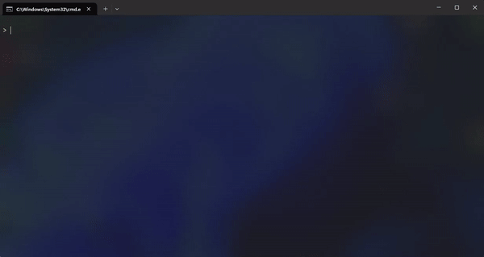

# Simple Switch Simulation 

This Python code simulates the operation of a network switch by generating and processing network frames. It allows users to specify the duration of the simulation, the number of connected PCs, and then simulates the transfer of frames between the PCs and the switch.

This simulation was developed as part of a school project.

> [!NOTE]
> This project works only on Windows because of msvcrt library

## Demo


## Getting Started
Get started by running the project locally, simply follow these steps:

- Clone/download the repo
    ```bash
    git clone https://github.com/ImShallo/simple-switch-simulation
    ```

- Navigate to the project directory
    
    ```bash
    cd simple-switch-simulation
    ```

- Install the required dependencies

    ```bash
    pip install -r requirements.txt
    ```

- Run the application

    ```bash
    python main.py
    ```

## Features
### Dynamic Frame Generation
- Generates frames with varying priorities dynamically and sends them to connected PCs within the simulated network.

### Visual Representation
- Utilizes rich text formatting for a visually appealing and informative display of simulation progress and results.

### Error Handling
- Robust error handling is implemented to prevent crashes and provide informative feedback to the user in case of unexpected situations or input errors.